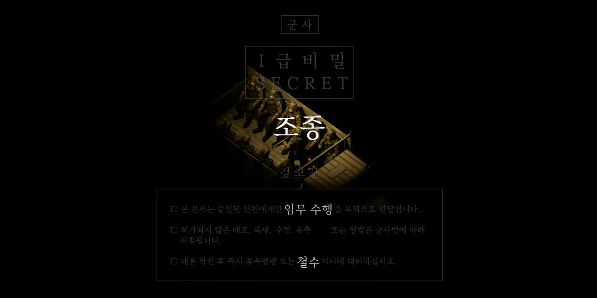
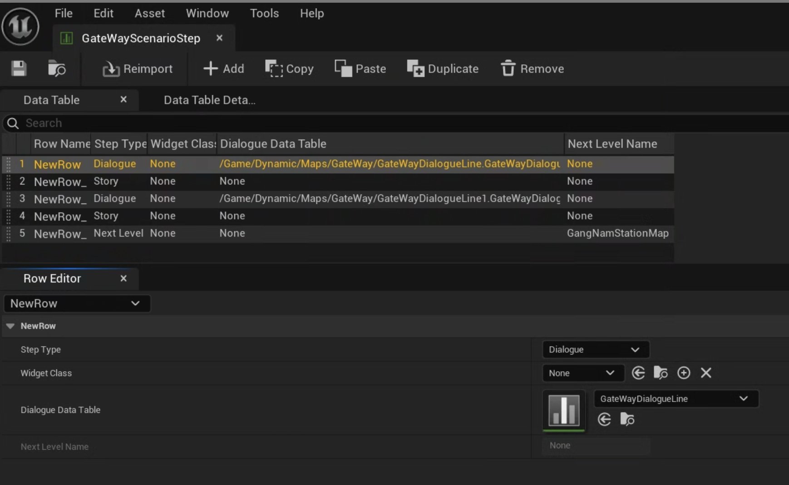
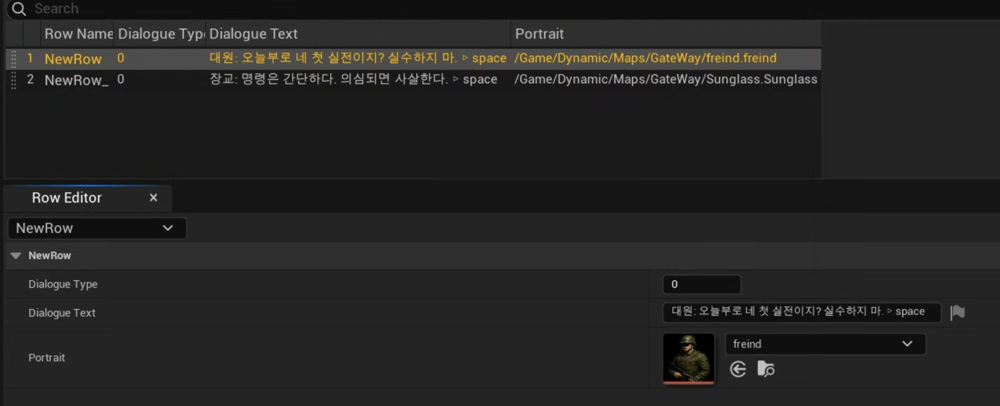

# 🎯 조종 (The Control) 프로젝트

## 📅 제작 기간
2025.08.11 ~ 08.30

## 🧰 플랫폼 / 툴
Unreal Engine 5, C++, Visual Studio 2022, Git, GameAIfy

## 📖 프로젝트 개요
스토리 기반 3D 탑다운 슈팅 게임으로, GameAIfy 주최 AI 기반 게임제작 공모전 2025 참가작입니다.  
인프라 개발자 친구가 기획을 담당했고, 본인은 클라이언트 전반을 단독으로 개발했습니다.

[프로젝트 영상 보기](https://www.youtube.com/watch?v=9GWHa0zE6Bo) 




## 1. 객체지향 기반 캐릭터 설계
- 다양한 캐릭터 타입을 효율적으로 관리하고 확장성을 고려한 계층적 클래스 구조 설계

```cpp
// 클래스 구조 예시
무기캐릭터 : ACharacter
├── 주인공캐릭터 : 무기캐릭터
└── 군인캐릭터 : 무기캐릭터

군중캐릭터 : ACharacter

// 이동 인터페이스
이동인터페이스 - 공통 이동 로직 인터페이스
├── 군인캐릭터 - 전술적 이동 패턴
└── 군중캐릭터 - 집단 이동 패턴
```

- 코드 재사용성을 높이고 기획 수정 시 개발 시간을 단축

---

## 2. 체계적인 UI 위젯 관리
- 단일 책임 원칙 준수
- 위젯 매니저를 통해 상/중/하단 대화창, 페이드 인/아웃 위젯, 특수 게임 모드 위젯 등 관리

```cpp
AGangNamPlayerController::AGangNamPlayerController()
{
	WidgetManager = CreateDefaultSubobject<UWidgetManager>(TEXT("WidgetManager"));
}
```
```cpp
//WidgetManager.h
UPROPERTY()
UBaseTextWidget* BottomDialogueWidget;

UPROPERTY()
UBaseTextWidget* MiddleDialogueWidget;

UPROPERTY()
UBaseTextWidget* TopDialogueWidget;

UPROPERTY()
UFadeWidget* FadeWidget;

UPROPERTY()
UBaseTextWidget* CurrentDialogueWidget;
```

---

## 3. 확장 가능한 게임모드 아키텍처
- 10개의 서로 다른 게임 모드를 효율적으로 관리하는 상속 구조 설계

```cpp
// 베이스 게임모드 메서드 예시
virtual void HandleStoryStep(const FScenarioStep& Step);
virtual void HandleDialogueStep(const FScenarioStep& Step);
virtual void HandleGameplayStep(const FScenarioStep& Step);
```

- 하위 게임모드에서 오버라이드 가능하도록 설계
- 스토리 진행, 플레이 진행, 대화 진행, 스테이지 전환 등 유연하게 처리

---

## 4. 데이터 기반 시나리오 관리
- 데이터 테이블을 활용하여 게임 시나리오 체계적으로 관리

  

- 시나리오 단계 열거형
    - 대화 단계: NPC 상호작용 및 스토리 진행
    - 플레이 단계: 실제 게임플레이 로직
    - 스토리 단계: 컷신 및 연출 관리
    - 스테이지 전환 단계: 다음 스테이지 레벨 오픈


- 대화 내용 구조체
    - 대화창 위젯: 상단, 중단, 하단 선택 가능
    - 대화 내용
    - NPC 이미지
